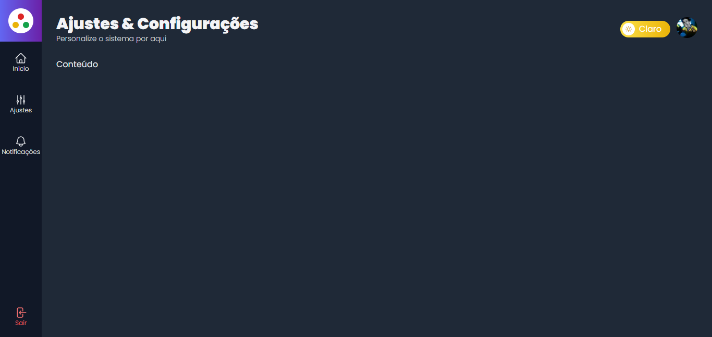

# Template Administrativo
Template administrativo com autenticação do Firebase.
É persistido o tema através do localStorage e a sessão por meio de cookies
com a utilização da biblioteca js-cookie




## ✨ Tecnologias
React | Next | TypeScript | TailwindCSS | Firebase

## 💻 Uso
Em seu terminal:
```bash
# Clone o repositório
git clone https://github.com/ViGF/admin-template.git
# Acesse a pasta do projeto
cd admin-template
# Instale as dependências
yarn add
#Adicione as variáveis de ambiente
#Na raiz do projeto crie um arquivo chamado .env.local, nele adicione as seguintes informações:
NEXT_PUBLIC_FIREBASE_API_KEY = Chave da sua API do seu projeto do Firebase
NEXT_PUBLIC_FIREBASE_AUTH_DOMAIN = Domínio de autenticação do seu projeto do Firebase
NEXT_PUBLIC_FIREBASE_PROJECT_ID = Id do seu projeto do Firebase
# Execute a aplicação
yarn dev
#Agora basta acessa-la
```

<div align="center">
  <small>Desenvolvido por Vitório Gomes - Setembro/2022</small>  
</div>